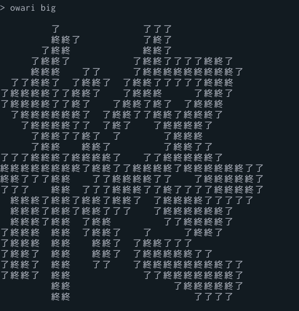
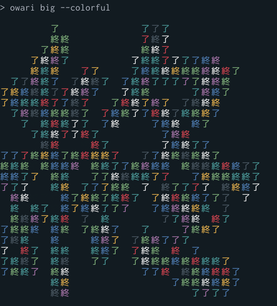
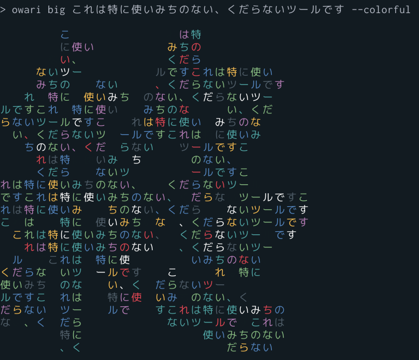

# owari
The End ASCII Art Generator

終焉にまつわるアスキーアートを出力するだけのコマンド

## Install
```sh
$ go get -u github.com/xztaityozx/owari
```

## Requirements
- Go >= 1.11.1

## Usage

```sh
$ owari [global flags] [sub command] [sub flags]
```

### Global flags

-   `--colorful`          カラフルにします  
-   `-n, --count string`      指定回数出力します．infか-1を指定すると無限になります (default "1")  
-   `--duration string`   繰り返しのインターバルです (default "0.5s")  
-   `-h, --help`              help for owari  
-   `--offset int`        左からの距離です  
-   `--overwrite`         複数回出力するときに同じ場所に上書きし続けます  
-   `-w, --width string`   表示幅です．autoにすると端末幅を取得します (default "auto")  
-   `-v, --version` バージョン情報を出力して終了します

### Sub Command
- `big`
    - 大きな「終」を出力します．引数を与えると文字が置き換わります
    - sub flags:
        - `--offset int` 左端からの距離を指定できます
- `default`
    - 某終了のロゴがでます．引数を与えると文字が置き換わります
    - alias: `def`
    - sub flags:
        - `--offset int` 右端からの距離を指定できます

- `help`
    - ヘルプを出力して終わります

- `kanban`
    - 看板みたいなのが出ます．引数を与えると文字が置き換わります
    - alias: `kan`
    - sub flags:
        - `-g, --giko` ギコ猫がつきます
        - `--offset int` 左端からの距離を指定できます
        - `-i, --stdin` 標準入力を受取ります

- `version`
  - バージョン情報を出力して終了します

## ScreenShots





        
        
## Contribute
AAを増やしてほしい時は，Pull RequestかIssueをお願いします

## LICENSE
[LICENSE](./LICENSE)
