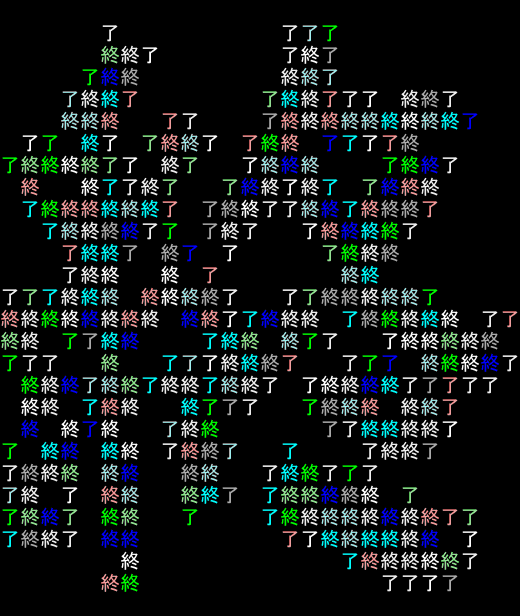

# owari

The End ASCII Art Generator

終焉にまつわるアスキーアートを出力するだけのコマンド

[](https://github.com/xztaityozx/owari/actions/workflows/go.yml)

## Install
### go install
 
- Go >= 1.18.0

```sh
$ go install github.com/xztaityozx/owari@latest
```

### GitHub Releases
[GitHub Releases](https://github.com/xztaityozx/owari/releases) からビルド済みのバイナリをダウンロードできます

## Usage

```sh
$ owari [global flags] [sub command] [sub flags]
```

### Global flags
Flags:

- `-c, --colorful`            
  - カラフルにします
- `-C, --colorful-always`     
  - colorfulフラグが有効なとき、パイプやリダイレクト時にもCOLOR＿CODEが適用されるよう強制します
- `-n, --count string`        
  - 指定回数繰り返します。負数かinfを指定すると無限になります (default "1")
- `-d, --duration duration`   
  - 繰り返しのインターバルです (default 500ms)
- `-h, --help`                
  - ヘルプを出力して終了します
- `-E, --insert-empty`        
  - 出力の1行目に必ず空白行を挿入します (default true)
- `--offset int`              
  - 左からの距離です
- `-o, --overwrite`           
  - 複数回出力するときに同じ場所に上書きし続けます
- `-v, --version`             
  - バージョン情報を出力して終了します


### Sub Command
- `big`
    - 大きな「終」を出力します．引数を与えると文字が置き換わります
- `default`
    - 某終了のロゴがでます．引数を与えると文字が置き換わります
    - alias: `def`
- `help`
    - ヘルプを出力して終わります
- `kanban`
    - 看板みたいなのが出ます．引数を与えると文字が置き換わります
    - alias: `kan`
- `grave`
    - 先祖代々のお墓を出力します
- `funnySunday`
    - 楽しい休日も終わってしまいました
- `dead`
    - いくら呼んでも帰っては来ないんだ
- `completion`
    - 各シェルにあった補完スクリプトをSTDOUTに出力します

## Completion
`completion`サブコマンドで補完スクリプトをSTDOUTに出力できます。今は`bash`,`zsh`,`fish`,`powershell`に対応しています

```shell
$ owari complete bash
$ owari complete fish
$ owari complete zsh
$ owari complete powershell
```

## ScreenShots
### `$ owari`


### `$ owari funnySunday`


### `$ owari grave`


### `$ owari kanban`


### `$ owari big`


### animation
```shell
$ owari big --overwrite --colorful --count 10
```



## Contribute
### AAがずれてるので修正したいとき
[ここ](./aa/arts/raw)にテンプレートとしてJSONを置き、特定のフォントの時はこういう出力にする。みたいなのを書いています。[kanbanサブコマンドのテンプレ](./aa/arts/raw/kanban.json)が参考になるかと思います

### サブコマンドを追加したいとき
ほかのサブコマンドの実装を参考にしてPul-Reqを送ってください。どうしても実装したくない場合はIssueを建ててください

## LICENSE
[LICENSE](./LICENSE)
